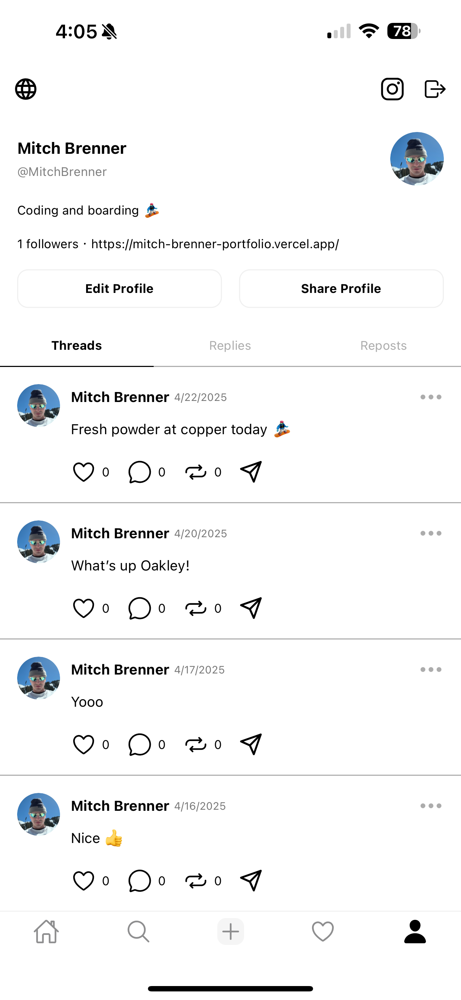

# Threads Clone

A cross-platform mobile app inspired by Threads (by Instagram), built using **React Native**, **Expo Router**, **Convex**, and **Clerk** for authentication. This clone replicates core social features like threaded conversations, profile management, and interactive UI, all optimized for iOS, Android, and Web via Expo.

---

## 🚀 Features

- Authentication via Clerk
- Secure, user-based data storage and retrieval
- Post threads and view other users' content
- Upload media with the native image picker
- Tab-based navigation and gesture support
- Real-time updates and notifications
- Clean UI with custom fonts and smooth animations
- Expo dev client support for native module testing

  
---

---

## 📱 Built With

### Core Frameworks & Tools

- **Expo** – Fast mobile development with access to native APIs
- **React Native** – Cross-platform mobile UI
- **Expo Router** – File-based routing for React Native apps
- **Convex** – Full-stack backend with real-time database and reactive queries
- **Clerk** – Drop-in authentication and user management for Expo

---

## 📦 Notable Libraries

- **@clerk/clerk-expo** – Secure authentication and user context
- **expo-image-picker** – For uploading images in threads
- **expo-notifications** – Push notification support
- **expo-blur, expo-haptics, expo-secure-store** – Enhancing UX and storing tokens
- **react-native-reanimated & gesture-handler** – Smooth animations and interactions
- **@expo/vector-icons** – Icon set integration

---

## 🧠 Architecture

- **Expo Router** is used for navigation with nested route layouts
- **Convex** handles backend logic, real-time data sync, and file storage
- **Clerk** manages auth, user sessions, and token handling
- **State is managed locally** through context and props

---

## 📲 Platform Support

- iOS
- Android
- Web (via Expo for Web)

> Uses `expo-dev-client` for testing native modules on simulators and real devices.

---

Built to explore full-stack mobile development using modern tooling and a file-based routing experience in React Native.
